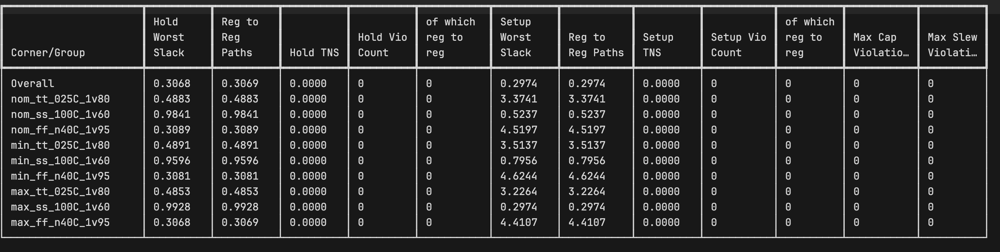

# Team NeCRL Design Phase 4 Final Report

**Team Members:** Parsa Mirfasihi, Waylon Woo, Ethan Weldon

**San Francisco State University**

## Design Overview

Our design is an AES-128 hardware encryption peripheral integrated onto the TinyQV RISC-V processor for the Tiny Tapeout shuttle.

- **Technology:** SkyWater SKY130 130nm CMOS (`sky130_fd_sc_hd` standard cell library)
- **Die Size:** 682.64 x 225.76 um (4x2 Tiny Tapeout tile)
- **Tools:**
  - **OpenLane 2.3.10** (end-to-end RTL-to-GDSII flow)
  - **Yosys** (synthesis)
  - **OpenROAD** (floorplanning, placement, CTS, routing, STA)
  - **Magic** (DRC, SPICE extraction, GDSII stream-out)
  - **KLayout** (secondary DRC, GDSII stream-out)
  - **Netgen** (LVS)

## Architecture

```
                          TinyQV RISC-V SoC
  ┌──────────────────────────────────────────────────────────────────┐
  │                                                                  │
  │   address [6] ──┐    data_out [32] ──┐                           │
  │   data_in [32] ─┤                    │                           │
  │   data_write [2]┤    data_ready ─────┤                           │
  │   data_read [2] ┤                    │                           │
  │                  ▼                   │                           │
  │  ┌──────────────────────────────────────────────────────────┐    │
  │  │                 AES-128 Peripheral                       │    │
  │  │                                                          │    │
  │  │  ┌──────────┐  plaintext [128]  ┌────────────────────┐  │    │
  │  │  │          │──────────────────▶│                    │  │    │
  │  │  │          │                   │  Encryption Engine │  │    │
  │  │  │  Memory  │  ciphertext [128] │                    │  │    │
  │  │  │          │◀──────────────────│  SubBytes          │  │    │
  │  │  │  (Key +  │                   │  ShiftRows         │  │    │
  │  │  │   Data   │                   │  MixColumns        │  │    │
  │  │  │  Banks)  │                   │  AddRoundKey       │  │    │
  │  │  │          │                   │                    │  │    │
  │  │  └──┬───┬───┘                   └──────▲─────────────┘  │    │
  │  │     │   │                              │ round_key[128] │    │
  │  │     │   │ original_key[128]            │                │    │
  │  │     │   │                       ┌──────┴──────────┐     │    │
  │  │     │   └──────────────────────▶│                 │     │    │
  │  │     │ start/done                │   Key Engine    │     │    │
  │  │  ┌──▼───────┐                  │                 │     │    │
  │  │  │          │ key_engine_start  │  (10-round      │     │    │
  │  │  │ Control  │─────────────────▶│   expansion)    │     │    │
  │  │  │   Unit   │ core_reset        │                 │     │    │
  │  │  │  (FSM)   │─────────────────▶└─────────────────┘     │    │
  │  │  │          │                                           │    │
  │  │  │          │ count [5]                                 │    │
  │  │  │          │─────────────────▶ Encryption Engine       │    │
  │  │  └──────────┘                                           │    │
  │  │                                                          │    │
  │  └──────────────────────────────────────────────────────────┘    │
  │                                                                  │
  └──────────────────────────────────────────────────────────────────┘
```

The peripheral is memory-mapped onto the TinyQV's bus. Software writes the 128-bit plaintext and key into the memory banks, asserts start, and polls the done flag. The control unit FSM sequences 10 rounds of encryption through the engine, with the key engine expanding the original key in lockstep. The final ciphertext is read back through the same memory interface.

## Register Map & Programming Model

### Register Map

All registers are 32-bit wide. Only 32-bit accesses are accepted (`data_write_n = 2'b10`, `data_read_n = 2'b10`).

| Address | Name | Access | Description |
|---------|------|--------|-------------|
| `0x00` | Control | R/W | See control register bit layout below |
| `0x01` | Status | R | See status register bit layout below |
| `0x02` | Key[0] | W-only | AES key bits [31:0] (LSW). **Reads always return 0.** |
| `0x03` | Key[1] | W-only | AES key bits [63:32] |
| `0x04` | Key[2] | W-only | AES key bits [95:64] |
| `0x05` | Key[3] | W-only | AES key bits [127:96] (MSW). **Reads always return 0.** |
| `0x06` | Plaintext[0] | R/W | Plaintext bits [31:0] (LSW) — writes to idle bank |
| `0x07` | Plaintext[1] | R/W | Plaintext bits [63:32] |
| `0x08` | Plaintext[2] | R/W | Plaintext bits [95:64] |
| `0x09` | Plaintext[3] | R/W | Plaintext bits [127:96] (MSW) — triggers auto_start if Control bit 3 is set |
| `0x0A` | Ciphertext[0] | R | Encrypted output bits [31:0] (LSW) |
| `0x0B` | Ciphertext[1] | R | Encrypted output bits [63:32] |
| `0x0C` | Ciphertext[2] | R | Encrypted output bits [95:64] |
| `0x0D` | Ciphertext[3] | R | Encrypted output bits [127:96] (MSW) |

#### Control Register (`0x00`)

```
  Bit 31 .......... Bit 4 | Bit 3      | Bit 2     | Bit 1      | Bit 0
  ────────────────────────────────────────────────────────────────────────
        (reserved)        | auto_start | key_lock  | soft_reset | start
```

| Bit | Name | Description |
|-----|------|-------------|
| 0 | `start` | Write 1 to trigger encryption. Auto-cleared by hardware when `done` goes high. |
| 1 | `soft_reset` | Write 1 to clear all memories and reset the engine to IDLE. Silently ignored if the engine is currently busy (`start == 1`) — it will not corrupt an in-flight encryption. |
| 2 | `key_lock` | Write 1 to lock the key registers (`0x02–0x05`) against further writes. Write 0 to unlock. Useful for multi-block key reuse. |
| 3 | `auto_start` | When set, writing the final plaintext word to `0x09` automatically asserts `start` — no separate control register write needed. |
| 31:4 | — | Reserved, write 0. |

#### Status Register (`0x01`)

```
  Bit 31 .......... Bit 4 | Bit 3         | Bit 2          | Bit 1  | Bit 0
  ─────────────────────────────────────────────────────────────────────────
        (reserved)        | selftest_fail | selftest_done  | fault  | done
```

| Bit | Name | Description |
|-----|------|-------------|
| 0 | `done` | 1 when encryption is complete. Cleared when a new encryption starts. |
| 1 | `fault` | 1 when the FSM/counter integrity check detected a violation. Engine is halted; only a hard reset (`rst_n`) can recover. |
| 2 | `selftest_done` | 1 when the power-on FIPS-197 known-answer self-test has completed. **The peripheral will not accept `start` until this bit is 1.** |
| 3 | `selftest_fail` | 1 if the self-test failed, indicating a manufacturing defect. The engine is permanently disabled until hard reset. |
| 31:4 | — | Reserved, read 0. |

#### Interrupt

The `user_interrupt` output is asserted for one cycle when `done` goes high. Software can use this instead of polling to reduce CPU overhead during the encryption window.

---

### How to Use

#### Boot Sequence

After `rst_n` deasserts, the peripheral automatically runs a FIPS-197 known-answer self-test before accepting any software-initiated encryption. **Software must wait for `selftest_done` (Status bit 2) before issuing a `start`.** If `selftest_fail` (Status bit 3) is set, the peripheral has detected a manufacturing defect and will not encrypt until a hard reset.

#### Basic Single-Block Encryption

1. Write the 128-bit key to `0x02–0x05` (4 × 32-bit words, LSW first)
2. Optionally set `key_lock` (Control bit 2) to prevent accidental key overwrite
3. Write the 128-bit plaintext to `0x06–0x09` (4 × 32-bit words, LSW first)
4. Write `0x1` to Control (`0x00`) to assert `start`
5. Poll `STATUS[0]` (`done`) until it reads `1` — or wait for the interrupt
6. Read the 128-bit ciphertext from `0x0A–0x0D` (4 × 32-bit words, LSW first)

#### Encryption Latency

Encryption takes **31 clock cycles** base (without any LFSR stall cycle). The count schedule from the RTL is:

```
count = 1:        init — AddRoundKey with original key                    (1 cycle)
count = 2–28:     rounds 1–9, each split into 3 phases (A, B1, B2)       (27 cycles)
count = 29–30:    final round — phase A (SubBytes) + phase B (ShiftRows + AddRoundKey, no MixColumns)  (2 cycles)
count = 31:       FSM transitions to DONE                                 (1 cycle)
─────────────────────────────────────────────────────────────────────────────────────
Total:            1 + 27 + 2 + 1 = 31 cycles
```

The final round uses only 2 cycles (not 3) because it skips MixColumns, eliminating the need for the `sr_reg` pipeline stage. At 57.1 MHz, 31 cycles = **542.5 ns** per block.

The LFSR random stall can add at most **1 extra stall cycle** per encryption (the stall budget was reduced from the DP3 design's 8 to 1 in DP4 to stay within the timing budget at the slow corner — see the note in the DP3 section below). Worst-case latency is therefore 32 cycles (560 ns).

#### Key Reuse

Write the key once, set `key_lock`, then encrypt successive blocks without re-writing the key. Because the key engine re-derives round keys on-the-fly in parallel with encryption, there is zero additional latency for key reuse.

#### Auto-Start Mode

Setting `auto_start` (Control bit 3) eliminates the separate start-write step. Writing the final plaintext word to `0x09` automatically triggers encryption. This saves one 8-cycle store instruction per block on the TinyQV CPU.

#### Double-Buffering

The plaintext input is double-buffered with two ping-pong banks (A and B). When `start` is asserted, the banks swap: the engine reads the just-filled bank while the CPU can immediately write the next block into the idle bank.

Because TinyQV is bit-serial and executes one instruction every 8 clock cycles, writing a full 128-bit block (4 × SW instructions) takes ~32 CPU cycles — essentially the same as the 31-cycle encryption window. Double-buffering lets these overlap:

```
Cycles   0–31:  CPU writes plaintext block 1 to 0x06–0x09 (~32 cycles)
Cycle   ~32:    CPU asserts start; banks swap — block 1 moves to engine read bank
Cycles ~32–62:  Engine encrypts block 1 (31 cycles)
Cycles ~32–63:  CPU simultaneously writes plaintext block 2 to idle bank (~32 cycles)
Cycle   ~63:    done asserts; CPU reads ciphertext 1 from 0x0A–0x0D, asserts start for block 2
```

Without double-buffering, the CPU would have to wait for `done` before writing block 2, adding a full ~32-cycle write to the critical path between consecutive encryptions.

#### Fault Recovery

If `STATUS[1]` (fault) reads 1, the FSM has entered its terminal FAULT state and the key and state registers have been wiped. **Only a hard reset (`rst_n`) can recover.** Soft reset will not clear a fault.

---

## Design Journey

### DP1 — RTL Design & Verification

In DP1 we designed and verified the AES-128 peripheral as synthesizable RTL. We chose AES-128 because it's a well-understood standard (FIPS-197) and small enough to fit on a constrained die. The design uses an iterative architecture — a single datapath is reused across all 10 encryption rounds, keeping area small at the cost of latency. We chose this over a fully unrolled implementation because Tiny Tapeout's die budget is tight, and reusing the datapath across rounds gave us a much smaller footprint.

The peripheral is composed of five submodules:

- **Memory interface (AES_memory):** Provides 32-bit register-mapped I/O between the RISC-V bus and the AES core. Stores the 128-bit key, plaintext, and ciphertext as four 32-bit words each, with control and status registers for start, done, and key lock.
- **Control unit (AES_control_unit):** A 4-state FSM (Loading → Counting → Done → Reset) with a round counter that sequences the encryption. It coordinates the key engine and encryption engine, asserting done when all 10 rounds complete.
- **Encryption engine (AES_encryption_engine):** The core datapath implementing all four AES round transformations — SubBytes, ShiftRows, MixColumns, and AddRoundKey. It maintains the 128-bit state internally and applies the transformations iteratively. The initial round performs only AddRoundKey, the 9 main rounds apply all four transformations, and the final round omits MixColumns per the AES specification.
- **Key expansion engine (AES_key_engine):** Generates round keys on-the-fly in synchronization with encryption rather than precomputing and storing all 11 keys. Each round key is produced exactly one cycle before it's needed, using word rotation, S-box substitution, round constant addition, and XOR-based word derivation. This meant we didn't need to store all 11 keys upfront.
- **S-box lookup table (sbox_lookup):** A purely combinational lookup table implementing the AES nonlinear byte substitution, shared by both the encryption engine (16 instances for the 16-byte state) and the key engine (4 instances for the 4-byte RotWord operation). This gave us 20 S-box instances total.

The top-level peripheral module integrated all submodules and connected them to the RISC-V system bus, allowing the AES accelerator to be accessed through standard memory-mapped load/store instructions without modifying the processor pipeline or instruction set.

Verification used a bottom-up, divide-and-conquer strategy. We built self-checking testbenches for each submodule — comparing DUT outputs against behavioral golden models embedded in the testbenches themselves — before integrating into a full system-level test. The testbench suite (`run_tb.py`) covers five levels: top-level integration, control unit FSM, encryption engine, key engine, and memory interface. All tests validate against standard FIPS-197 test vectors. This let us catch bugs at the module level before they got buried in integration.

### DP2 — Design Evaluation & PPA Optimization

DP2 was about exploring how different RTL architectures affected PPA and figuring out what tile size we actually needed. The DP1 design had 20 S-box instances (16 in the encryption engine + 4 in the key engine), and we wanted to see how far we could push the area down. We iterated through several design variants:

1. **S-box serialization (V2):** Reduced to 4 shared S-boxes, but the area savings were not as significant as expected — the added steering logic actually increased cell count by 21% — and the critical path ballooned from 0.21 ns to 11.22 ns. Abandoned.
2. **Galois Field arithmetic S-box (V3):** Replaced the lookup-table S-boxes with composite field math. Cell count dropped 47% and die area shrank 47%, but switching power jumped 250% due to spurious toggling through the dense combinational logic.
3. **Operand isolation (V4):** The GF S-box's power problem was spurious switching — even when the AES module is idle or computing a different stage, any incidental change on the data bus ripples through the entire combinational network. We initially tried clock gating but found it didn't help as much as expected — the gating logic added area and routing complexity while only reducing power by 1–2%, because the real switching was happening in the purely combinational S-box logic, not the flip-flops. Instead we added AND-gate masking at the S-box inputs to hold operands static when the block isn't active, killing the spurious toggling at its source. This brought switching power back in line while keeping the area gains.
4. **2-phase architecture (V5):** Halved the S-box count from 20 to 10 (8 encryption + 2 key engine) by processing the 128-bit state in two phases per round. Cell count dropped to 7,476 with clean routing. Since the design is I/O-bound — TinyQV's bit-serial CPU spends far more cycles on bus transactions than the AES engine spends encrypting — the extra cycles per round cost no real-world performance, making this a straightforward trade of area for latency that doesn't matter.

After these optimizations we found that the design fit comfortably on a 4x2 Tiny Tapeout tile, which is what we went with.

The key insight from DP2 was that the design is I/O-bound, not compute-bound. TinyQV's bit-serial CPU takes 8 clock cycles per instruction, so the I/O overhead for loading a single 128-bit plaintext (32 cycles) already exceeds the encryption itself (23 cycles at 10 S-boxes vs 11 cycles at 20). Halving the S-box count cost us 12 extra encryption cycles but saved 20% cell area with negligible impact on real throughput.

### DP3 — Security Hardening

DP3 shifted focus from PPA to security. We ran a multi-agent security evaluation using an agent chatroom pattern — three AI agents (cryptography reviewer, hardware side-channel analyst, and adversarial red team) each independently analyzed the RTL, then entered a structured debate over three rounds. In each round, the agents critiqued each other's findings, challenged severity ratings, and proposed mitigations. Items the agents converged on were accepted into the final ranked list. Items they couldn't reach consensus on — specifically, whether unmasked S-boxes and the two-phase SubBytes fault window warranted fixing given our die budget — were flagged as open disagreements and deferred to our judgment. The process produced a ranked list of 8 vulnerabilities.

We fixed 6 of the 8 identified vulnerabilities:

1. **Key readable via bus (CRITICAL):** The original memory interface stored the 128-bit secret key at addresses 0x02–0x05 and allowed any bus master to read it back in plaintext. The existing `key_lock` feature only prevented *writes* after lock was asserted — reads were completely unprotected. An attacker with bus access could trivially extract the key without ever performing an encryption. Fix: the memory module now returns zero for all reads to key addresses regardless of lock state, making the key registers write-only.

2. **No FSM/counter integrity (CRITICAL):** The control unit used a 2-bit binary-encoded FSM and a 5-bit binary round counter with no error detection. A single voltage glitch or bit-flip could skip encryption rounds (weakening the cipher) or jump the FSM directly to the DONE state (outputting partially encrypted data as if it were valid ciphertext). Fix: the FSM was re-encoded as one-hot (any single bit-flip produces an illegal state), a shadow counter was added that maintains the invariant `count + count_shadow == 31` (any corruption in either counter is detectable), and a terminal FAULT state was introduced that zeroes all internal registers — key, plaintext, ciphertext, and state — making the module unrecoverable without a hard reset.

3. **Soft-reset race condition (HIGH):** If software issued a soft reset while encryption was in progress, the reset would wipe the key expansion registers mid-computation. The key engine would resume from a corrupted intermediate state, producing malformed ciphertext. An attacker who could trigger resets at precise moments could collect these malformed outputs and use differential analysis to recover key material. Fix: the soft reset signal is now gated on engine-idle — the control unit ignores reset requests while encryption is active, and the reset only takes effect once the current operation completes or the engine is already idle.

4. **Fixed execution timing (MEDIUM):** Every encryption operation took exactly the same number of clock cycles regardless of input data. While AES is inherently constant-time at the algorithmic level, this made differential power analysis (DPA) trivial — an attacker collecting power traces could perfectly align every trace without needing to account for timing variation, dramatically reducing the number of traces needed to extract the key. Fix: an LFSR-driven random stall mechanism inserts a variable number of dummy cycles during encryption, randomizing the total execution time across operations and breaking trace alignment.

5. **No fault visibility (MEDIUM):** If the FSM entered the FAULT state due to a detected integrity violation, software had no way to distinguish this from a normal "still encrypting" status. The done flag would never assert, and the CPU would poll indefinitely with no indication that something went wrong. Fix: a dedicated fault bit was added to the status register, allowing software to detect and respond to integrity failures — for example, by logging the event, alerting the system, or initiating a hard reset.

6. **No power-on self-test (LOW):** After fabrication, there was no mechanism to verify that the AES implementation was functionally correct before trusting it with real data. A manufacturing defect in the S-box logic or key expansion could silently produce wrong ciphertext. Fix: the peripheral now runs an automatic FIPS-197 known-answer test at boot — it encrypts a standard test vector and compares the result against the expected ciphertext. If the test fails, a `selftest_fail` flag is set in the status register and the control unit blocks all encryption requests until hard reset.

Two vulnerabilities were deliberately deferred:

- **Unmasked S-boxes (Rank 3):** The Galois Field S-box implementation processes key-dependent intermediate values through combinational logic without boolean masking, making it theoretically vulnerable to power analysis attacks that correlate switching activity with secret key bytes. Implementing a masked S-box (e.g., domain-oriented masking) would require duplicating the S-box datapath for each share, roughly doubling S-box area.

- **Two-phase SubBytes fault window (Rank 4):** The 2-phase architecture processes the 128-bit state in two 64-bit halves. During the first phase, the second half of the state sits in registers unprotected. A precisely timed fault injection during this window could corrupt the unprocessed half, producing a faulty ciphertext that enables differential fault analysis (DFA) to recover the key. Protecting against this would require redundant computation or error-detection codes on the state register, again roughly doubling S-box area.

Both fixes would have exceeded our 4x2 tile die budget. The total security overhead for the 6 implemented fixes was +2.4% cell area.

> **Note on LFSR stall budget:** The DP3 design allowed up to 8 random stall cycles per encryption. In DP4, this was reduced to a maximum of 1 stall cycle to stay within the timing budget at the slow corner (the stall logic sits on a path that interacts with the 9-cycle synthesis constraint). This means the DPA timing-jitter countermeasure provides minimal desynchronization in the final implementation — a tradeoff that would be worth revisiting in a future tape-out with more timing margin.

### DP4 — Signoff & Tapeout

DP4 was about getting the design through the full OpenLane RTL-to-GDSII flow and closing all signoff checks. Our first clean DRC/LVS run had setup timing failing by -6.20 ns at the slow corner. Over 34 runs we pipelined the critical path, discovered that relaxing the clock period doesn't help (the synthesizer just picks smaller cells), and landed on an aggressive 9 ns synthesis constraint with 17.5 ns signoff. After timing closed, we fixed the remaining slew/cap violations with an RTL-level `keep_hierarchy` fix on the MixColumns logic. The details are in the next section. The cell count also grew significantly from the DP2 V5 baseline of 7,476 cells to 11,725 in the final DP4 design. This delta is accounted for by: the `sr_reg` pipeline register and associated control logic added for timing closure (+~600 cells), the DP3 security hardening (+2.4%, ~180 cells), and the 1,135 timing repair buffers inserted by OpenROAD to meet the 9 ns synthesis constraint.

## Challenges & Fixes (Design Phase 4)

### Timing Closure at the Slow Corner

Our initial runs came back clean at a 14.8 ns clock period at most corners, but setup timing failed at the slow corners (ss_100C_1v60) with a worst negative slack of **-6.20 ns**. We quickly identified the critical path as the S-box combinational logic in the AES round — a deep chain of gates from the control unit's count register through the full encryption round and back to the state register.

We restructured the RTL to pipeline the critical path, inserting a register stage (`sr_reg`) between ShiftRows and MixColumns to split the round into two cycles:

```
  BEFORE (single-cycle round):

  count ──▶ SubBytes ──▶ ShiftRows ──▶ MixColumns ──▶ AddRoundKey ──▶ state_reg
  reg                    ~~~~ entire round is one combinational path ~~~~          reg


  AFTER (two-cycle round):

  Phase B1:
  count ──▶ SubBytes ──▶ ShiftRows ──▶ sr_reg
  reg                                    reg     ◀── path cut here

  Phase B2:
             sr_reg ──▶ MixColumns ──▶ AddRoundKey ──▶ state_reg
              reg                                        reg
```

This improved the worst slack from **-6.20 ns to -2.48 ns** — a 3.7 ns improvement that cleaned up the typical and fast corners, but the slow corner still failed. The trade-off was latency: total encryption went from 11 cycles to 31 cycles, since each of the 9 non-final rounds now takes 3 cycles instead of 1. In practice this doesn't matter in terms of AES-128 performance — TinyQV is a bit-serial CPU that processes 4 bits per clock cycle, so each 32-bit store instruction takes 8 cycles to execute. Writing a single 128-bit plaintext block requires 4 stores = 32 cycles of I/O alone, which already exceeds the full encryption time.

We then tried increasing the clock period to give more slack, going from 14.8 ns to 17.5 ns and eventually 20 ns. However, this didn't help nearly as much as expected. We discovered that the synthesizer (Yosys with AREA 0 strategy) was re-targeting to the looser clock — with more timing budget available, it picked smaller, lower-drive cells to save area. Those smaller cells are disproportionately slower at the worst PVT corner, so the data path grew almost as much as the clock period did. A 2.5 ns clock bump from 17.5 to 20 ns only improved WNS by 0.21 ns — the synthesizer ate the rest.

The fix was to do the opposite: we constrained synthesis and PnR with an aggressive 9 ns clock period, forcing the tools to pick large, high-drive cells, and then signed off at the real 17.5 ns target. The over-constrained layout had so much margin built in that even the slow corner closed comfortably.

### Slew/Cap Violations (MixColumns Gate Sharing)

With timing closed, we were left with 8 max_slew and 1 max_cap violations. All of them traced back to the MixColumns and AddRoundKey stages of the encryption datapath. The root cause was Yosys flattening the design and sharing XNOR gates across the MixColumns GF(2^8) multiply and the downstream AddRoundKey XOR — creating high-fanout nets with long wires that exceeded slew and capacitance limits. Every violation came from a single driver fanning out to 8+ loads.

We first tried addressing this with `MAX_FANOUT_CONSTRAINT`, telling the synthesizer to clone high-fanout drivers. This backfired catastrophically — the cloned cells were inserted at minimum drive strength, so each clone drove fewer loads but with worse slew than the original strong driver. Slew violations jumped from 8 to 73.

We also attempted an ECO (Engineering Change Order) approach: surgically inserting buffers on the violating nets using OpenROAD's `repair_design` post-route. This failed for two reasons:

1. **DRT-0218 errors** — The post-GRT resizer inserted buffers and resized gates, creating pins without global routing guides. DetailedRouting could not legally connect them.
2. **Re-routing invalidated the fix** — Disabling the post-GRT resizer eliminated the DRT errors, but full re-routing changed wire parasitics enough that the original violations returned (and worsened to 16 slew + 2 cap).

### RTL Fix: `keep_hierarchy`

We probably could have continued debugging the ECO flow and eventually gotten it to work, but our design is small enough that a full OpenLane run takes under 20 minutes. It was just easier to fix the problem at the RTL level and re-run the whole flow than to fight with post-route surgical fixes.

We extracted the MixColumns logic into a dedicated `mix_columns` module with the Yosys attribute `(* keep_hierarchy = "yes" *)`. This prevented the synthesizer from merging gates across the module boundary, eliminating the high-fanout cross-boundary sharing. The next OpenLane run came back with **zero slew, cap, and fanout violations** across all corners.

## Signoff Results

### DRC

**Passed.** Zero violations in both Magic and KLayout DRC checks.

### LVS

**Passed.** Netgen layout-vs-schematic confirmed the routed netlist matches the gate-level netlist with zero mismatches.

### STA

**Passed.** Full 9-corner multi-PVT static timing analysis (3 RC extraction corners × 3 PVT corners: ss_100C_1v60, tt_025C_1v80, ff_n40C_1v95) with zero setup and hold violations.



| Corner | Setup WNS | Hold WNS |
|--------|-----------|----------|
| nom_tt_025C_1v80 | +3.3741 ns | +0.4883 ns |
| nom_ss_100C_1v60 | +0.5237 ns | +0.9841 ns |
| nom_ff_n40C_1v95 | +4.5197 ns | +0.3089 ns |
| min_tt_025C_1v80 | +3.5137 ns | +0.4891 ns |
| min_ss_100C_1v60 | +0.7956 ns | +0.9596 ns |
| min_ff_n40C_1v95 | +4.6244 ns | +0.3081 ns |
| max_tt_025C_1v80 | +3.2264 ns | +0.4853 ns |
| max_ss_100C_1v60 (worst setup) | +0.2974 ns | +0.9928 ns |
| max_ff_n40C_1v95 (worst hold) | +4.4107 ns | +0.3068 ns |

The signoff clock period is 17.5 ns (57.1 MHz), but we constrained synthesis and PnR with a tighter 9 ns period. Early on, we ran the tools with the real 17.5 ns target and couldn't close timing at the slow corner (ss_100C_1v60). Relaxing the period further didn't help — the tools just saw more slack and backed off, placing cells further apart and using smaller buffers, so the slow corner stayed tight no matter what. We found that giving the tools an aggressive 9 ns constraint forced them to optimize hard, and the resulting layout comfortably meets the real 17.5 ns target across all corners. The slew/cap violations described above were a separate issue solved by the `keep_hierarchy` RTL fix.

### Max Slew / Max Cap

**Passed.** Zero max slew and zero max capacitance violations across all corners. Earlier runs had 8 max slew and 1 max cap violation caused by Yosys flattening the MixColumns logic and sharing XNOR gates across module boundaries, creating high-fanout nets that exceeded slew and capacitance limits. The `keep_hierarchy` RTL fix on the MixColumns module eliminated all of them.

### Antenna

**14 pin violations across 12 nets.** The worst ratio is 1.61× (limit 400, actual 644). These are marginal violations on met1/met3 layers. OpenLane inserted 1,762 antenna diode cells and 24 explicit antenna diodes during routing. The remaining violations are within the range that Tiny Tapeout's infrastructure handles at the top level, and are not expected to cause manufacturing failures. The worst excess factor is 1.61× the PDK limit — far below the threshold where manufacturing failures occur — and the 1,762 diode cells already inserted by OpenLane represent OpenLane's standard repair pass having already addressed the more serious violations.

## Final PPA

### Performance

| Metric | Value |
|--------|-------|
| Signoff Clock Period | 17.5 ns |
| Signoff Frequency | 57.1 MHz |
| Encryption Latency (base) | 31 clock cycles (542.5 ns) |
| Encryption Latency (worst case, +1 LFSR stall) | 32 clock cycles (560 ns) |
| Peak Throughput (no stall) | 236 Mbit/s (128 bits / 542.5 ns) |
| Worst-Case Throughput (1 stall) | 228 Mbit/s (128 bits / 560 ns) |
| Worst Setup Slack (max_ss_100C_1v60) | +0.2974 ns |
| Worst Hold Slack (max_ff_n40C_1v95) | +0.3068 ns |

### Power

| Metric | Value |
|--------|-------|
| Total Power | 5.68 mW |
| Internal Power | 3.79 mW (66.7%) |
| Switching Power | 1.89 mW (33.3%) |
| Leakage Power | 0.10 µW (<0.01%) |
| Worst IR Drop | 0.183 mV |

### Area

| Metric | Value |
|--------|-------|
| Die Area | 154,113 µm² (682.64 × 225.76 µm) |
| Core Area | 149,082 µm² |
| Core Utilization | 66.3% |
| Standard Cells | 11,725 |
| Sequential Cells (flip-flops) | 1,111 |
| Combinational Cells | 5,381 |
| Timing Repair Buffers | 1,135 |
| Clock Buffers/Inverters | 111 |
| Fill Cells | 7,487 |
| Routed Wirelength | 355,621 µm |
| Vias | 69,298 |

### Signoff

| Check | Result |
|-------|--------|
| DRC (Magic) | 0 violations |
| DRC (KLayout) | 0 violations |
| LVS (Netgen) | 0 mismatches |
| Setup/Hold Violations | 0 / 0 |
| Slew/Cap/Fanout Violations | 0 / 0 / 0 |
| Antenna | 14 pin violations (12 nets) |

## Reflections

### Team

We started with five members but lost two early in the project, which was stressful — none of us knew yet whether the remaining three could cover everything between us. On top of that, nobody had a lot of free time. Waylon was interning full-time at Tenstorrent while attending classes and doing research. Parsa was finishing his master's research paper, preparing to graduate and getting ready for his PhD. Ethan, a first-year master's student, was carrying a full course load alongside other projects.

We didn't sit down and assign roles upfront. It was more organic than that — we all worked on everything at first (DP1), and over time people naturally gravitated toward what they were strongest at. Ethan kept going deeper on the RTL and architecture side, so he became our lead there — designing the AES submodules, building the testbench suite, and driving the architecture iterations in DP2. Waylon had the most physical design background, so when we hit the OpenLane flow he ended up leading that — debugging timing closure, chasing down slew violations, and figuring out how our RTL decisions were affecting what the tools could actually close. The two worked closely throughout the project to keep architecture and PD aligned. Parsa held everything together on the project management side — tracking milestones, coordinating deliverables, running design reviews, and jumping in wherever gaps needed to be filled and fixed the technical bugs, from the DP3 security evaluation to the final submission packaging.

Though we had leads, there were no silos. Ethan helped run PPA flows, Parsa helped write testbenches, Waylon helped write RTL changes. Everyone had enough context across the full stack that we could pitch in wherever the bottleneck was. We lost two people but the three of us happened to cover each other's gaps well enough that nothing fell through.

### AI

AI was genuinely useful for generating first-draft RTL. Ethan could describe a module's interface and behavior and get working Verilog back in minutes. It wasn't always correct, but it was close enough that fixing it was faster than writing from scratch. For a team of three with limited time, that mattered. The testbench generation was similar — AI could produce a reasonable self-checking testbench structure that we'd then fill in with the right stimulus and expected values. It handled the boilerplate so we could focus on the actual verification logic.

Where AI surprised us was the security evaluation in DP3. The agent chatroom pattern — three specialized agents debating vulnerabilities across multiple rounds — found things we wouldn't have thought to look for. The key-readable-via-bus vulnerability was obvious in hindsight, but none of us had flagged it in months of working on the design. Having agents with different perspectives argue about it surfaced the blind spots that come from being too close to your own code.

AI was also unexpectedly capable at reasoning through physical design issues. When we were stuck on timing closure, AI could parse OpenLane reports, trace the critical path, and reason about why relaxing the clock period wasn't helping — it identified that the synthesizer was re-targeting to smaller cells and eating the slack. It traced the slew violations back to Yosys flattening MixColumns and sharing XNOR gates across module boundaries, and proposed the `keep_hierarchy` RTL fix. That kind of cross-layer reasoning — connecting RTL structure to synthesis behavior to physical routing outcomes — was not something we expected AI to do well, and it saved us significant debugging time.

That said, it wasn't perfect. AI hallucinated sometimes — confidently proposing fixes that didn't make sense or misinterpreting tool output. That was where having someone with a physical design background mattered. Waylon could tell the difference between a plausible-sounding suggestion and one that would actually work, which kept us from chasing AI-generated dead ends. The pattern that worked best was AI doing the heavy lifting on analysis and proposing solutions, with a human sanity-checking the output before we committed to anything.

Put simply, we couldn't have done this without AI. Three people with full-time commitments outside this project would not have gotten a design from RTL to clean GDSII signoff across four design phases without it. It accelerated RTL development, generated test scaffolding, ran a security review that found real bugs, and debugged physical design issues that would have taken us much longer to work through on our own. The judgment calls — which architecture to pursue, when to abandon a failing approach, whether to defer a security fix for die budget — still came from us. But AI is what made it possible for three busy people to actually get this done.

### Takeaways

1. **Run PPA early and don't assume how your RTL will translate to PD.** In DP2 we assumed that fewer S-boxes would mean less area. It didn't — the muxing and control logic needed to share them added more gates than we saved. That assumption cost us about a week and a half of development effort chasing a dead end. The lesson was to run PPA as early as possible and let the tools tell you what's actually happening, rather than reasoning about it from the RTL alone. Our design was small enough that a full OpenLane run took under 20 minutes, so there was no reason not to just try an idea and see. The 2-phase architecture came out of that mindset — we tried it, ran PPA, and the numbers confirmed it was the right trade-off.

2. **AI is actually really good at hardware design.** Going in, we weren't sure how much we'd actually trust AI-generated RTL. By the end, it was writing most of our first-draft Verilog, generating testbench scaffolding, catching security vulnerabilities we'd missed for months, and reasoning through OpenLane reports to debug timing and slew issues. It wasn't always right, but it was right often enough that having a human review its output was far faster than doing everything from scratch. For a three-person team with limited time, that was the difference between finishing and not.

3. **Work with the tools, not against them.** We kept running into situations where the tools would undo our fixes. We'd relax the clock period to give more slack and the synthesizer would just use the room to pick smaller cells. We'd patch a slew violation post-route and the re-routing would bring it back. After enough rounds of this we realized the pattern — stop trying to force a specific outcome and instead set up the inputs so the tools' natural optimization works in your favor. Over-constrain synthesis so it picks beefy cells. Fix the RTL so the synthesizer can't create the bad sharing in the first place. Once we stopped fighting the tools things went a lot smoother.
